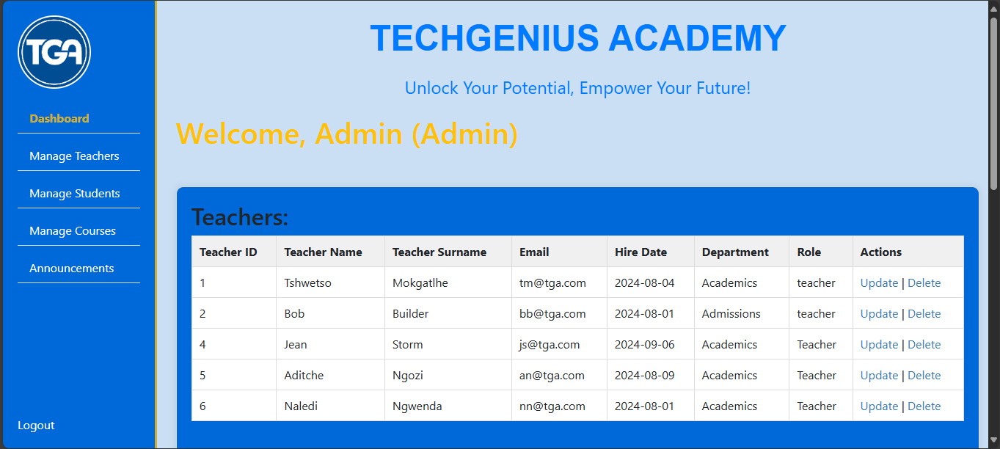
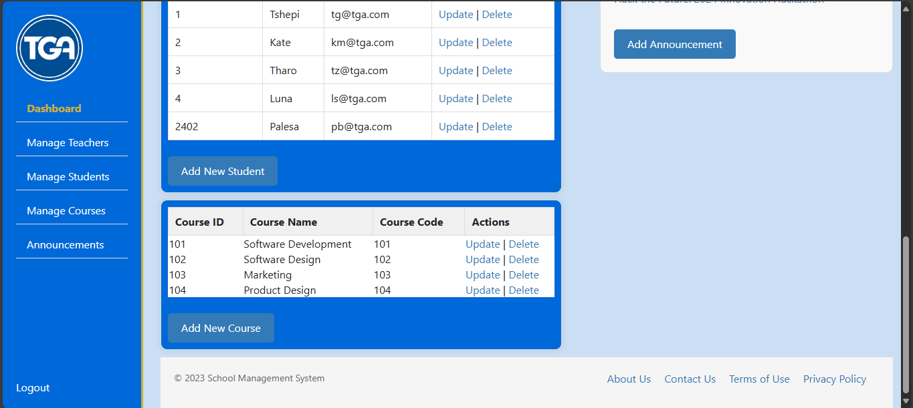
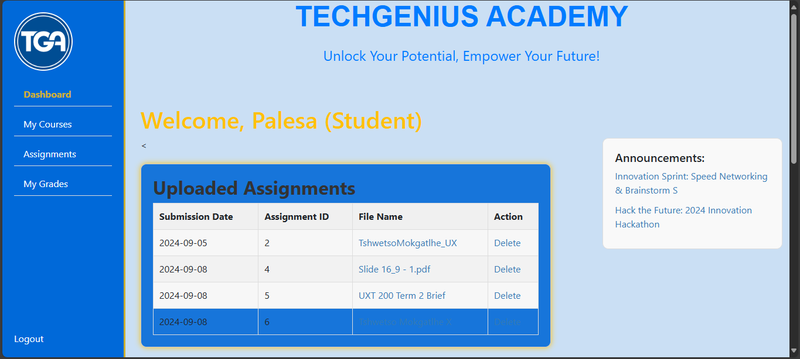
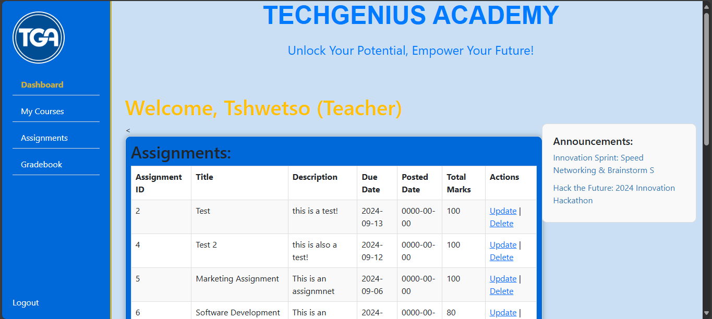

<br />


<h5 align="center" style="padding:0;margin:0;">Tshwetso Mokgatlhe</h5>
<h5 align="center" style="padding:0;margin:0;">221411</h5>
<h6 align="center">DV200 | Term 3</h6>
</br>
<p align="center">

  <a href="https://github.com/TshwetsoMo/tga.git">
    
  </a>

<h3 align="center">Tech Genius Academy</h3>

  <p align="center">
    This is a school management system that is made for administrators to be able to add, remove, and edit data about users (teachers & studnents) with the help of a mySQL database in myPHPAdmin. It also alows teachers to add and grade assignments as well as allows students to submit their assignments and view their grades.<br>

   <br />
   <br />
   <!-- <a href="https://youtu.be/8iZ_rSmcN0E">View Demo</a> -->
    ·
    <a href="https://github.com/TshwetsoMo/tga/issues">Report Bug</a>
    ·
    <a href="https://github.com/TshwetsoMo/tga/issues">Request Feature</a>
</p>
<!-- TABLE OF CONTENTS -->

## Table of Contents

- [About the Project](#about-the-project)
  - [Project Description](#project-description)
  - [Built With](#built-with)
- [Getting Started](#getting-started)
  - [Prerequisites](#prerequisites)
  - [How to install](#how-to-install)
- [Features and Functionality](#features-and-functionality)
- [Concept Process](#concept-process)
  - [Ideation](#ideation)
  - [Wireframes](#wireframes)
- [Development Process](#development-process)
  - [Implementation Process](#implementation-process)
    - [Highlights](#highlights)
    - [Challenges](#challenges)
  - [Future Implementation](#peer-reviews)
- [Final Outcome](#final-outcome)
  - [Mockups](#mockups)
  - [Video Demonstration](#video-demonstration)
- [Conclusion](#conclusion)
- [License](#license)
- [Contact](#contact)
- [Acknowledgements](#acknowledgements)

<!--PROJECT DESCRIPTION-->

## About the Project

<!-- header image of project -->

<!-- ![image1][image1] -->

### Project Description

Welcome to Tech Genius Academy! This website was built using php and mySQL database, it is similar to a varsity portal where teachers, students, and even admin have access to different pages and functionalities of the school website respectively. Admins are able to Add, Update, and Delete teachers, students, courses, and announcements. Teachers are able Add, Update, and Delete assignments as well as grade submissions. Students are able to Submit and Delete Assignments as well as view their marked assignments.

### Built With

[&nbsp;&nbsp;&nbsp;&nbsp;&nbsp;&nbsp;&nbsp;&nbsp;](https://www.phpmyadmin.net/)

<!-- [&nbsp;&nbsp;&nbsp;&nbsp;&nbsp;&nbsp;&nbsp;&nbsp;](https://expressjs.com/) -->

[&nbsp;&nbsp;&nbsp;&nbsp;&nbsp;&nbsp;&nbsp;&nbsp;](https://reactjs.org/)[&nbsp;&nbsp;&nbsp;&nbsp;&nbsp;&nbsp;&nbsp;&nbsp;](https://www.php.net/docs.php) [&nbsp;&nbsp;&nbsp;&nbsp;&nbsp;&nbsp;&nbsp;&nbsp;](https://getbootstrap.com/docs/4.1/getting-started/introduction/) [&nbsp;&nbsp;&nbsp;&nbsp;&nbsp;&nbsp;&nbsp;&nbsp;](https://github.com/TshwetsoMo/tga)

<!-- [&nbsp;&nbsp;&nbsp;&nbsp;&nbsp;&nbsp;&nbsp;&nbsp;](https://nodejs.org/en/) -->

<!-- [&nbsp;&nbsp;&nbsp;&nbsp;&nbsp;&nbsp;&nbsp;&nbsp;](https://ionicframework.com/)
[&nbsp;&nbsp;&nbsp;&nbsp;&nbsp;&nbsp;&nbsp;&nbsp;](https://nodemailer.com/about/) -->

<!-- ### Hosted With
[&nbsp;&nbsp;&nbsp;&nbsp;&nbsp;&nbsp;&nbsp;&nbsp;](https://www.heroku.com/) -->

<!-- GETTING STARTED -->
<!-- Make sure to add appropriate information about what prerequesite technologies the user would need and also the steps to install your project on their own mashines -->

## Getting Started

These instructions will help you get your copy of the project up and running on your local machine for development and testing purposes.

### Prerequisites

For development, you will need to install XAMP so you can access the database via myPHPadmin. You must also be familiar withmySQL [XAMP](https://www.apachefriends.org/download.html)

### Installation

Here are a couple of ways to clone this repo:

1.  GitHub Desktop </br>
    Enter `https://github.com/TshwetsoMo/tga.git` into the URL field and press the `Clone` button.

2.  Clone Repository </br>
    Run the following in the command-line to clone the project:

    ```sh
    git clone https://github.com/TshwetsoMo/tga.git
    ```

3.  Run XAMP </br>
    1. Start up the XAMP software.
    2. Under the actions column, press 'Start' for Apache and MySQL
    3. Once they start running you my press 'Admin' next to My SQL. This will take you to the database.
    4. once in the database you'll have to create a new database by navigating the left side navbar.
    5. once you have created a empty database, you will have to import the sql file that is in the code into the database.
    6. Once you've successfully imported the sql file the database should fill up with data that you will have access too via your code.

## Features and Functionality

<!-- note how you can use your gitHub link. Just make a path to your assets folder -->

<!-- CONCEPT PROCESS -->
<!-- Briefly eOpenStacklain your concept ideation process -->
<!-- here you will add things like wireframing, data structure planning, anything that shows your process. You need to include images-->

## Concept Process

I went with a minimalistic design that would be easy on the eyes but at the same time still prioritises the display of the text. Tech Genius Academy is a school website that is there to make life easier for all the users (Admins, Students, and Teachers)
The process that i took for this project was that or trial and error as well as exploring other similar works and tryinhg to learn from what others have done while making my own project unique. Most of the focus was on functionality.

### Wireframes

<!--  -->


## Development Process

The `Development Process` is the technical implementations and functionality done for the app.

### Implementation Process

- I used `Apache` and `MySQL` via the `XAMP` software to initialize and create the database. I used Reactjs, HTML, CSS, alongside PHP to create this PHP project. I implemented component-based development instead of classes. By doing this, I will be able to easily import and export components and sub-components into different parts of my project, making it more efficient.

- I used bootstrap5 to style my project as well as custom css on top of that. I also made use of inline styling and including a style section in the header of the DOC files.

<!-- and used `module.scss` to style each individual component. An id get given to each classname, making the styling super easy -->

<!-- edit, delete and send (CRUD) data to it -->

#### Highlights

stipulated the highlight you experienced with the project

- A very big high obstacle was getiing my login page to work, i realised later that it was a matter of specifiying which columns in the data tables are Primary and Foreign keys.
- I had to start again with 2 weeks left of the term due to a XAMP software malfunction that caused me to lose my data, but upon starting over again i realised it was much easier and took less time to make progress than the first 6 weeks i had to do it.
- Getting my CRUD functionality working on multiple entities in the data.
- The website being fully responsive

#### Challenges

stipulated the challenges you faced with the project and why you think you faced it or how you think you'll solve it (if not solved)

- The largest issue I had was creating the database correctly. Given that the database serves as the foundation of the whole project it was impossible to make progress without first perfecting the database structure (This really emphasised the importance of our ER diagrams for me). It was also a mission trying to avoid all the many-to-many relationships in the database by creating extra entities to handle the load.

- getting my layout correct was also an issue but I managed to solve the issue by sizing and positioning entities in a specific manner so that they do not overlap.

- Getting my CRUD functionality to work on my database.

- Time management was also an issue that i had but luckily i was able to increase my effort towards the end when the fear of failure got closer.

- Something I unfortunately could not implement because of time restrictions was the registration page. I left if for last because from my understanding a school management system is for people that have already been put in the database not for students and teachers to register for the school in.

### Future Implementation

<!-- TODO Change this! -->

stipulate functionality and improvements that can be implemented in the future.

- I will ensure to create an all the extra main pages that are mentioned in the navbar. Most of the things i am being tested on are on the dashboards of all users so i didnt have a need for the main pages just yet.

- I want to work more on the frontend. Make it look more sleek and futuristic.

<!-- - We would like to make this a fully responsive website
- We would like to implement dark mode
- Implement Pagination on Questions Page -->

<!-- MOCKUPS -->

## Final Outcome

### Mockups

<!-- TODO Change this -->







<br>

<!-- VIDEO DEMONSTRATION -->

### Video Demonstration

<!-- TODO Change this -->

<!-- To see a run through of OpenStack, click below: -->

[View Demonstration](https://drive.google.com/file/d/1vxoQ9avBlB38hYGfCe3dDFmHuzkZpbxm/view?usp=sharing)

See the [open issues](https://github.com/TshwetsoMo/tga/issues) for a list of proposed features (and known issues).

<!-- AUTHORS -->

## Author

- **Tshwetso Mokgatlhe** - [Github](https://github.com/TshwetsoMo)

<!-- LICENSE -->

## License

Distributed under the MIT License. See `LICENSE` for more information.\

<!-- LICENSE -->

## Contact

**Tsebo Ramonyalioa** - [Personal email](tshwetsomokgatlhe@gmail.com)[School Email](221411@virtualwindow.co.za) - [GitHub](https://github.com/TshwetsoMo)

- **Project Link** - https://github.com/TshwetsoMo/tga.git

<!-- ACKNOWLEDGEMENTS -->

## Acknowledgements

<!-- all resources that you used and Acknowledgements here -->
<!-- TODO Change this -->

- [BlackBox AI](https://www.blackbox.ai/)
- [Figma](https://www.figma.com/)
- [ChatGPT](https://chatgpt.com/)

[image11]: ./images/admin1.png
[image12]: ./images/student1.png
[image13]: ./images/teacher1.png
